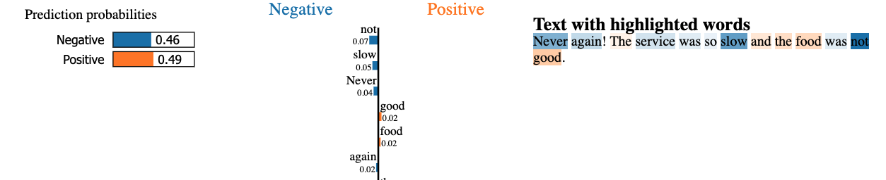

# CZ4045 Natural Language Processing - Assignment 1
## Files
Files are labelled according to the portion in the Report.

## Installation manual

All python libraries need for the individual sections will be installed in the respective .ipynb file. <br/>

For 1.2, 1.3, 1.4, 1.5, 3 - only python libraries are needed. <br/>

For `2. Extraction of indicative adjective phrase.ipynb`, a stanford core server is required to run in the background.

### Stanford Core server
#### To download and install stanford core nlp
1. Please visit https://stanfordnlp.github.io/CoreNLP/download.html to download stanford core nlp and unzip the downloaded file
2. Download and install Java
For windows: https://www.java.com/en/download/help/windows_manual_download.html <br/>
For macs: https://www.java.com/en/download/help/mac_install.html <br/>
For linux: https://java.com/en/download/help/linux_x64_install.html <br/>

#### To run background server
1. open a terminal at the directory of stanfore core nlp file
2. run the following command in terminal
``` bash
java -mx4g -cp "*" edu.stanford.nlp.pipeline.StanfordCoreNLPServer -preload tokenize,ssplit,pos,lemma,ner,parse,depparse -status_port 9000 -port 9000 -timeout 100000000000000000000000 &
```
With this, the server should be started and you should be able to see `[main] INFO CoreNLP - StanfordCoreNLPServer listening at /0:0:0:0:0:0:0:0:9000` <br/>

After this, `2. Extraction of indicative adjective phrase.ipynb` can be run. <br/>

## Results for 3.4 Application

**Input text: "I ordered this chair last week. The condition was really good. The support is comfortable for the back and the seat is strong"**

LIME output:


**Input text: "Never again! The service was so slow and the food was not good."**

LIME output:


Using the LIME tool we are able to identify the probability of contribution to a specific label for every token in the text. From the 2 sample predictions above we can see that the model is more confident in making positive predictions as the dataset is biased towards positive reviews. Although words like 'Never' or 'Not' are used one positive word 'good' contributes highly towards the final prediction of the negative review.

## Python dependencies
1. VADER
2. [Natural Language Toolkit](https://www.nltk.org/install.html)
3. [spaCy](https://spacy.io/usage)
4. [pandas](https://pandas.pydata.org/docs/getting_started/install.html)
5. [Natural Language Toolkit](https://www.nltk.org/install.html)
6. [BeautifulSoup](https://www.crummy.com/software/BeautifulSoup/bs4/doc/#installing-beautiful-soup)
7. [numpy](https://numpy.org/install/)
8. [requests](https://docs.python-requests.org/en/latest/user/)
9. [docx2text](https://pypi.org/project/docx2txt/#history)
10. [language_tool_python](https://pypi.org/project/language-tool-python/)
11. CNA Post Documents


